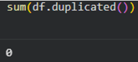

# Data Science Project

## Projects

### Project Background - Working From Home Burnout

Since Covid more people have been working from home.  This project has been taken from surveyed data for people who work from home to see what factors affect the risk of burnout.

Every person is different and can handle stress in different ways and have different lifestyles. This project is to try and highlight if there are any significant factors that affects everyone in the same way therefore creating a risk of ‘burnout’.

The data was initially split into Low, Medium and High categories for burn out, and this has now been amended to show only Low and have combined both Medium/High into one category to specifically check for anything which may result in a burnout score which is not Low.  Additionally, by doing this, the data has been more evenly spread for machine learning use.

### Data Infrastructure and Tools

The dataset has been extracted from Kaggle: https://www.kaggle.com/datasets/aryanmdev/remote-work-burnout-and-social-isolation-2026/data

The dataset has 2000 rows of data which comprises of various aspects in a working day that may affect an individual’s chance of burnout.  No personal identifiable information is held in the data.

Nothing states that this is manufactured data.  The data does need to be checked and cleansed appropriately, checking for missing data and removing any duplications, null values etc.

The ETL process is that the data has been extracted in Excel format and Python will be the main application to cleanse and apply relevant statistical analysis and visualisations and to apply linear regression.

### Data Engineering

The data has been checked and cleansed for:
•	Null values – none found 
•	Duplications – none found
•	Correct Data Types none found 
•	Possible Outliers – outliers found but based on the data these are minimal but relevant within the data

No further cleansing needed to be applied to the data.

The ‘burnout risk’ was initially split into ‘low’, ‘medium’ and ‘high’ categories.  With the project attempting to identify a potential risk of burnout, the data has been amended to merge both medium and high risk together, shown as 1 for ‘Low’ and 2 for ‘Medium/High’ and by doing so provides a more even split between the low risk and higher risk areas for modelling accuracy.

### DATA VISUALISATIONS:

With a filter applied in Excel, it is easy to see that out of the 2000 rows of data, there appear to be multiple User Id's in the data, with which on varying days the same user can show a different burn out risk/score.

In total there were 150 User Id's within the data.

Due to the distinct User Id's and to fully understand how Burnout is affecting the surveyed employees, a count of Users was applied for User Id’s who only work weekdays.  

In total there were zero users who only worked weekends which highlights that all users will only work weekdays.

